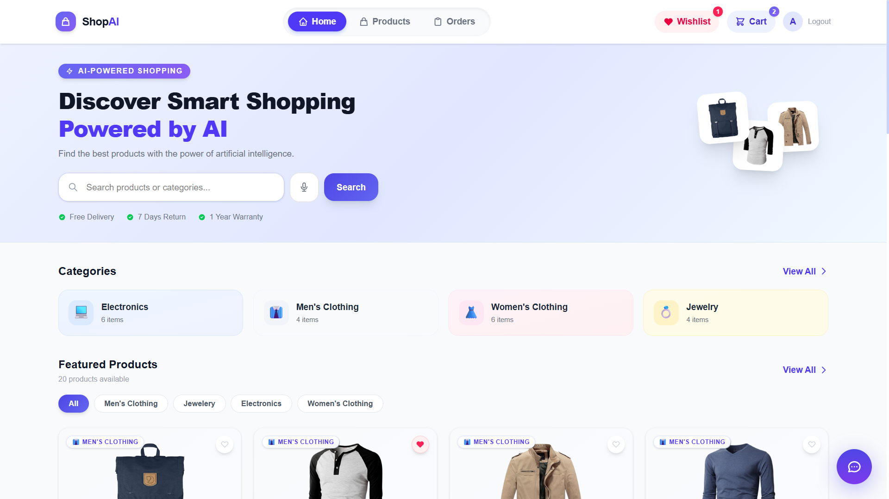
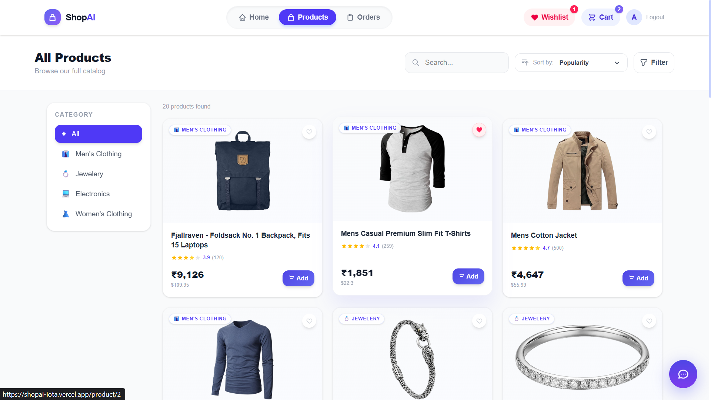
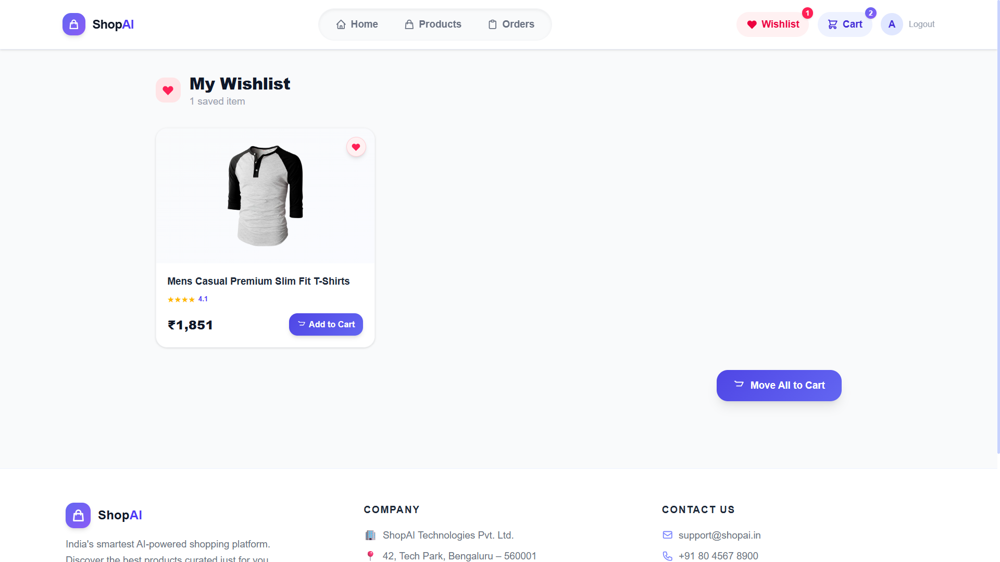
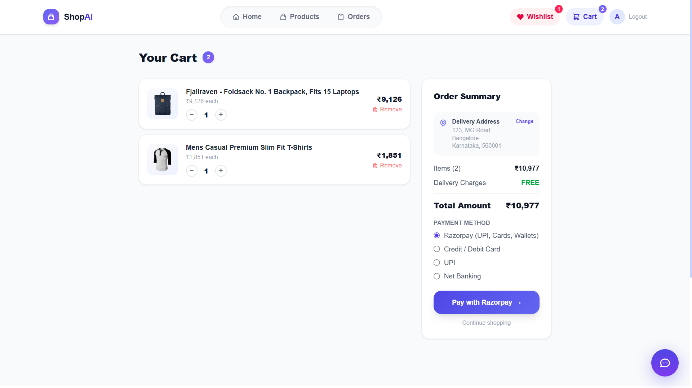
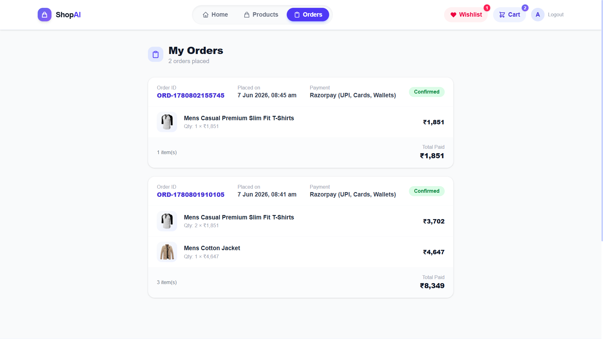
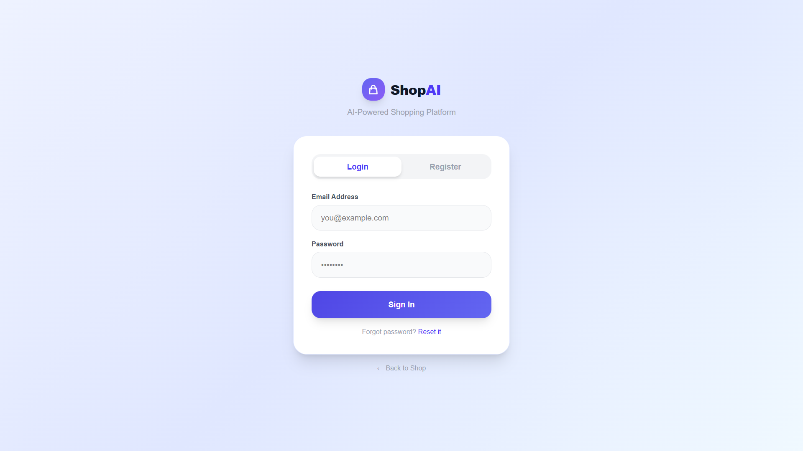

# 🛍️ ShopAI — AI-Powered E-Commerce App

A full-stack e-commerce web app powered by AI, built with React, Supabase, and Gemini AI.

🔗 **Live Demo:** [shopai-iota.vercel.app](https://shopai-iota.vercel.app)

---

## 📸 Screenshots

### 🏠 Home

### 🛒 Products

### ❤️ Wishlist

### 🛍️ Cart

### 📦 Orders

### 🔐 Login

---

## ✨ Features

- 🤖 AI-powered shopping assistant (Gemini AI)
- 🔐 User authentication (Supabase Auth)
- ❤️ Wishlist — save favourite products
- 🛒 Cart with quantity management
- 📦 Order history stored in Supabase
- 🔍 Product search and filter
- 📱 Fully responsive design

---

## 🛠️ Tech Stack

| Frontend | Backend | AI | Deployment |
|---|---|---|---|
| React + Vite | Supabase | Gemini AI | Vercel |
| Tailwind CSS | PostgreSQL | | |
| React Router | Supabase Auth | | |

---

## 👨‍💻 Author

**Arunprasanna** — [GitHub](https://github.com/arunprasannawork-afk)
